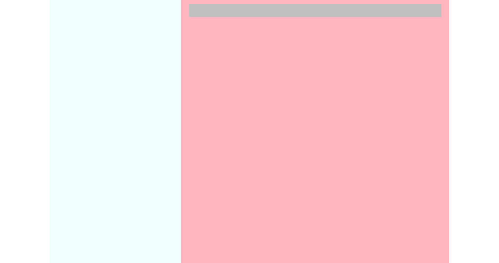

使用纯 CSS 构建一个两栏的布局，其 html 结构如下所示：

```html
<div class="content">
	<div class="sidebar">
	</div>
	    
	<div class="main">
	  <div class="title"></div>
	</div>
</div>
```

其中，`.sidebar` 为固定宽度 `15em` 位于左侧，`.main` 为自动宽度，左侧 `.sidebar` 高度永远与右侧 `.main` 保持一致。



# 前提

想要完成这个项目，你需要知道一个基本的 HTML 语法：

* 知道什么是 HTML 标签
* 知道一些基本的标签，比如 `div`

你需要知道 CSS 的基本概念和语法：

* 什么是 CSS
* 什么是 CSS 选择器（selector）
* 如何对一个元素设置 `border` `margin` `width`
* 如何用 `class` 选择器对特定元素设置 css
* 什么是一个 html 元素的 `position` 
* 如何利用 css 设置元素的

并且，你需要知道一些 `git` 的基本使用方式：

* 知道如何 `clone` 远端的 `git` 仓库
* 知道如何将添加或者修改后的文件提交到本地 `git` 仓库
* 知道如何将本地的仓库提交到远端的仓库

还有，你可能需要知道一些 `nodejs` 以及 `npm` 的知识，**不过在目前这个项目，这些不是必须的**：

* 知道什么是 `nodejs`
* 知道如何利用 `npm` 对 HTML Javascript 的项目进行依赖管理

# 环境

为了构建这个项目，你需要至少将下面加 `*` 的东西安装到你的电脑上：

1. [`git`](https://git-scm.com/) `*`
2. `nodejs` 
3. `npm`

# 构建

在 `public` 目录下有多个 html 文件，每个文件都引入了 `public/style.css` 文件。编辑 style.css 文件，为 `.main` `.content` `.sidebar` 编辑样式，似的每个 html 的布局满足 `backstop_data/bitmaps_reference` 下对应文件的效果。

1. 基本的两栏布局
2. 外面包裹有背景色的元素时的两栏布局
3. 左边栏高度大于右侧时的两栏布局
4. 将该两栏布局嵌入另一个两栏布局所实现的三栏布局

其他没有说明的样式请按照图片中的效果进行修改。

# 在本地执行测试

首先，这一步不是必须的。

按照下面的步骤安装必要的工具：

1. 安装 [node.js](https://nodejs.org/en/)
2. 安装 [PhantomJS](http://phantomjs.org/download.html)

然后执行以下命令安装其他依赖

```
$ npm install -g casperjs
$ npm install -g backstopjs
```

在本地执行测试

```
$ backstop test
```

> **注意** 由于不同操作系统下同样的字体的展示也有可能存在一定的区别，如果没有对字体做任何修改但是在本地的测试无法通过请联系 [@aisensiy](https://github.com/aisensiy)。